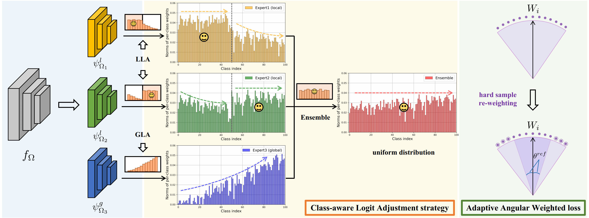

# Local and Global Logit Adjustments (LGLA) Model

This repository is the official Pytorch implementation of [Local and Global Logit Adjustments for Long-Tailed Learning](https://openaccess.thecvf.com/content/ICCV2023/papers/Tao_Local_and_Global_Logit_Adjustments_for_Long-Tailed_Learning_ICCV_2023_paper.pdf) (ICCV 2023).


> **Abstract:** Multi-expert ensemble models for long-tailed learning typically either learn diverse generalists from the whole dataset or aggregate specialists on different subsets. However, the former is insufficient for tail classes due to the high imbalance factor of the entire dataset, while the latter may bring ambiguity in predicting unseen classes. To address these issues, we propose a novel Local and Global Logit Adjustments (LGLA) method that learns experts with full data covering all classes and enlarges the discrepancy among them by elaborated logit adjustments. LGLA consists of two core components: a Class-aware Logit Adjustment (CLA) strategy and an Adaptive Angular Weighted (AAW) loss. The CLA strategy trains multiple experts which excel at each subset using the Local Logit Adjustment (LLA). It also trains one expert specializing in an inversely long-tailed distribution through Global Logit Adjustment (GLA). Moreover, the AAW loss adopts adaptive hard sample mining with respect to different experts to further improve accuracy. Extensive experiments on popular long-tailed benchmarks manifest the superiority of LGLA over the SOTA methods.

<p align="center">

</p>

## Requirements
* To install requirements: 
```
pip install -r requirements.txt
```

## Datasets 
* Please download datasets: ImageNet-LT, iNaturalist 2018, and Places-LT and put them to the corresponding "data_dir" in the config file.
* CIFAR-100/CIFAR-10 will be downloaded automatically with the dataloader.


## Pretrained models
* For the training on Places-LT, we follow previous methods and use the [pre-trained ResNet-152 model](https://github.com/zhmiao/OpenLongTailRecognition-OLTR).
* Please download the checkpoint. Unzip and move the checkpoint files to /model/pretrained_model_places/.


## Training
### (1) CIFAR10-LT 

* To train the LGLA model on CIFAR10-LT with IF=50, run this command:
```
python3 train.py -c configs/config_cifar10_ir50_lgla.json
```

* To train the LGLA model on CIFAR10-LT with IF=100, run this command:
```
python3 train.py -c configs/config_cifar10_ir100_lgla.json
```

### (2) CIFAR100-LT 

* To train the LGLA model on CIFAR100-LT with IF=50, run this command:
```
python3 train.py -c configs/config_cifar100_ir50_lgla.json
```

* To train the LGLA model on CIFAR100-LT with IF=100, run this command:
```
python3 train.py -c configs/config_cifar100_ir100_lgla.json
```

### (3) ImageNet-LT

* To train the LGLA model on ImageNet-LT with the backbone ResNet50, run this command:
```
python3 train.py -c configs/config_imagenet_lt_resnet50_lgla.json
```

* To train the LGLA model on ImageNet-LT with the backbone ResNeXt50, run this command:
```
python3 train.py -c configs/config_imagenet_lt_resnext50_lgla.json
```

### (4) iNaturalist 2018

* To train the LGLA model on iNaturalist 2018, run this command:
```
python3 train.py -c configs/config_iNaturalist_resnet50_lgla.json
```

### (5) Places-LT

* To train the LGLA model on Places-LT, run this command:
```
python3 train.py -c configs/config_places_lt_resnet152_lgla.json
```


## Evaluate
* To evaluate LGLA model on the above benchmarks, run:
``` 
python test.py -r checkpoint_path
``` 

## Citation
If you find this repo useful for your research, please consider citing the paper
```
@inproceedings{tao2023local,
  title={Local and Global Logit Adjustments for Long-Tailed Learning},
  author={Tao, Yingfan and Sun, Jingna and Yang, Hao and Chen, Li and Wang, Xu and Yang, Wenming and Du, Daniel and Zheng, Min},
  booktitle={Proceedings of the IEEE/CVF International Conference on Computer Vision},
  pages={11783--11792},
  year={2023}
}
``` 

## Acknowledgement
The code is adopted from [SADE](https://github.com/Vanint/SADE-AgnosticLT/tree/main). We sincerely appreciate for their contributions.
